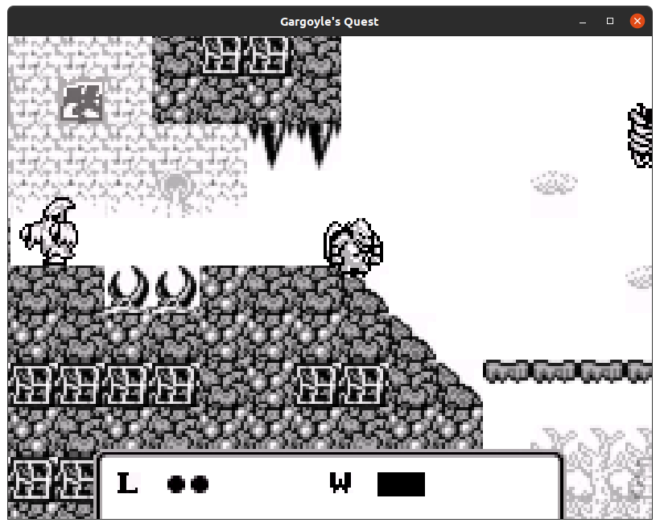

# Platformer
A remake of the first level of the delightful 1990 Gamebody platformer [Gargoyle's Quest](https://en.wikipedia.org/wiki/Gargoyle%27s_Quest).



## Dependencies

Most dependencies are managed by `cargo`, but men plan and god laughs, so `cmake` is required to build `shaderc`, and on linux `libudev` is required to build `gilrs`. Probably more, but I developed this on Ubuntu with a ton of dev libs arleady installed.


```bash
# play the game
cargo run

# start at an arbitrary checkpoint (checkpoint 0 is level start, 1 is about halfway, and 2 is the boss)
cargo run -- -c 1

# play with original gameboy aspect ratio and viewport zoom
cargo run -- --gameboy
```
## Controls
- **A/D** Move left and right
- **W** Jump, hold to jump higher. Pres again while in-air to hover briefly.
- **Space** Fire

**Note**: Gamepad input is supported, and *much more fun*.

## TODO:

1. Sound effects and music
2. Postprocessing to perform palette-shifts for fullscreen fade-in and out. This could be done in my existing sprite shaders but a post-processing shader will let me do some grimy gameboy-like effects on the output too.
3. Update to `wgpu-rs` 0.7

## Why?

To learn [wgpu](https://github.com/gfx-rs/wgpu), and to get more experience in Rust. That's why I didn't use any of the the eminently capable rust game engines out there like [Amethyst](https://amethyst.rs/) or [Bevy](https://bevyengine.org/) - there's nothing like wasting months of your waning adult life building something silly more-or-less-from-scratch to learn a new language.